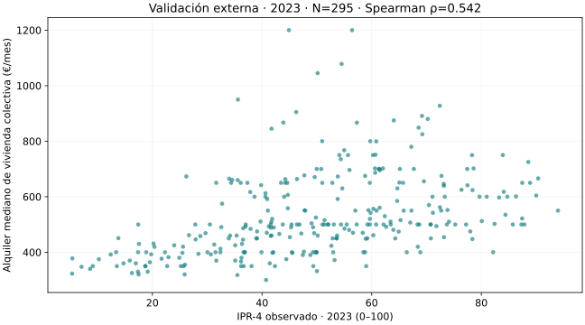
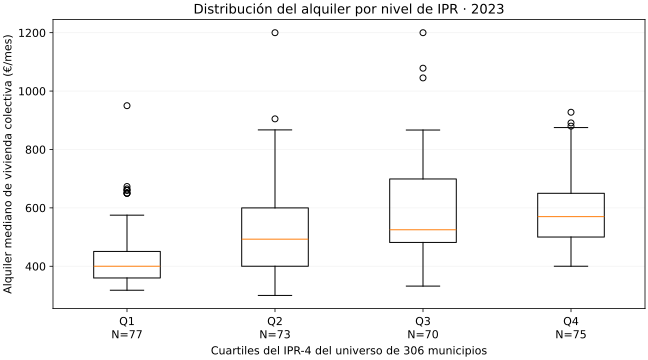

# Validación externa del IPR: resultados

Informe generado por `24_validacion_externa_ipr.py`. Protocolo y candidatos:
[evaluación previa](CANDIDATOS_VALIDACION_EXTERNA.md).

Indicador: **Mediana mensual del alquiler de vivienda colectiva**, EUR/mes. Fuente:
[MIVAU SERPAVI](https://cdn.mivau.gob.es/portal-web-mivau/Datos_MIVAU/CSV/VDP001_01.csv). Corte principal: 2023.
Descarga: 2026-09-11T16:20:56.722014+00:00. Hash y linaje: `data/processed/validacion_externa/manifest.json`.

Se observa una asociación positiva consistente con la hipótesis de mayores costes de alquiler en municipios con mayor IPR. Esto aporta un contraste convergente limitado al coste
del alquiler; no certifica que el IPR sea correcto ni que todas sus dimensiones
estén validadas. No se ajustaron sus pesos o componentes.

## Hipótesis fijada antes del cálculo

H1: Mayor IPR-4 observado se asociará con mayor mediana mensual del alquiler de vivienda colectiva en 2023 (rho > 0). H0: Ausencia de asociación monotónica (rho = 0).
Prueba bilateral, alfa 0.05. Spearman con 19999 permutaciones,
semilla 202309; p mínimo posible 5e-05.
La dirección positiva se evalúa junto con el p bilateral, sin cambiar de prueba.

## Cobertura y ausencias

| anio | observados | ausentes | universo |
| --- | --- | --- | --- |
| 2022 | 295 | 11 | 306 |
| 2023 | 295 | 11 | 306 |
| 2024 | 306 | 0 | 306 |

Ausentes en 2023 (sin imputación; no se codifican como cero):

| cod_ine | nombre | estado |
| --- | --- | --- |
| 01059 | Vitoria | sin_registro |
| 48013 | Barakaldo | sin_registro |
| 48015 | Basauri | sin_registro |
| 48020 | Bilbao | sin_registro |
| 48027 | Durango | sin_registro |
| 48036 | Galdakao | sin_registro |
| 48044 | Getxo | sin_registro |
| 48054 | Leioa | sin_registro |
| 48078 | Portugalete | sin_registro |
| 48082 | Santurtzi | sin_registro |
| 48084 | Sestao | sin_registro |

## Correlaciones y robustez

Solo `principal` es el contraste principal. Los demás son exploratorios;
no se selecciona el mayor coeficiente ni se interpretan sus p-values como
confirmaciones independientes. Cobertura = N/306 en todas las filas.

| analisis | producto | periodo_ipr | periodo_externo | n | universo | cobertura | rho | p_value | p_asintotico | metodo_p | estado |
| --- | --- | --- | --- | --- | --- | --- | --- | --- | --- | --- | --- |
| principal | ipr4_nacional_observado | 2023 | 2023 | 295 | 306 | 0.964052 | 0.542331 | 5e-05 | 5.87777e-24 | permutación bilateral de rangos; corrección +1 | estimado |
| sin_extremos_p01_p99 | ipr4_nacional_observado | 2023 | 2023 | 284 | 306 | 0.928105 | 0.529647 | 5e-05 | 6.13397e-22 | permutación bilateral de rangos; corrección +1 | estimado |
| ipr5_exploratorio | ipr5_prospectivo | 2023 | 2023 | 293 | 306 | 0.957516 | 0.50934 | 5e-05 | 9.56186e-21 | permutación bilateral de rangos; corrección +1 | estimado |
| ipr4_misma_muestra_ipr5 | ipr4_nacional_observado | 2023 | 2023 | 293 | 306 | 0.957516 | 0.543775 | 5e-05 | 6.02977e-24 | permutación bilateral de rangos; corrección +1 | estimado |
| sensibilidad_temporal_muestra_comun | ipr4_nacional_observado | 2023 | 2023 | 295 | 306 | 0.964052 | 0.542331 | 5e-05 | 5.87777e-24 | permutación bilateral de rangos; corrección +1 | estimado |
| sensibilidad_temporal_muestra_comun | ipr4_nacional_observado | 2023 | 2022 | 295 | 306 | 0.964052 | 0.529709 | 5e-05 | 9.71257e-23 | permutación bilateral de rangos; corrección +1 | estimado |
| sensibilidad_temporal_muestra_comun | ipr4_nacional_observado | 2023 | 2024 | 295 | 306 | 0.964052 | 0.551999 | 5e-05 | 6.32188e-25 | permutación bilateral de rangos; corrección +1 | estimado |

Sin extremos: se retiraron 11 observaciones,
fuera de P1–P99 de alguna variable: 02009, 02081, 11006, 13082, 15019, 28022, 28080, 28115, 29067, 29901, 38028.
La sensibilidad temporal mantiene IPR 2023 y restringe a municipios con alquiler
en los tres años; no es una serie histórica del IPR ni predicción causal.
No calculado: se contrasta relación monótona sin asumir linealidad ni normalidad.

## Exploración de distribuciones

| variable | n | media | desviacion | min | p25 | mediana | p75 | max | outliers_1_5_iqr |
| --- | --- | --- | --- | --- | --- | --- | --- | --- | --- |
| ipr_universo | 306 | 50 | 19.2291 | 5.36162 | 36.7068 | 49.9952 | 63.4691 | 93.9826 | 0 |
| ipr_pareado | 295 | 49.8814 | 19.5229 | 5.36162 | 36.5429 | 49.9325 | 63.7175 | 93.9826 | 0 |
| alquiler_mediano_mensual | 295 | 531.409 | 152.048 | 300 | 407.3 | 500 | 627.5 | 1200 | 4 |

Los outliers descriptivos usan 1,5 × IQR; son distintos del recorte de robustez
P1–P99. Se conservan todos en el análisis principal. No se aplica transformación
al alquiler ni se calcula esfuerzo dividiendo por renta del propio IPR.

## Grupos de presión

| cuartil | n | mediana | p25 | p75 |
| --- | --- | --- | --- | --- |
| Q1 | 77 | 400 | 360 | 450.9 |
| Q2 | 73 | 492.7 | 400 | 600 |
| Q3 | 70 | 525.1 | 481.525 | 699.05 |
| Q4 | 75 | 570 | 500 | 650 |

Kruskal–Wallis global, exploratorio:

| h | p_value | estado |
| --- | --- | --- |
| 86.4273 | 1.28161e-18 | estimado_exploratorio |

Los límites proceden del IPR de los 306 municipios; los empates permanecen
juntos. El contraste global no identifica por sí solo diferencias Q1–Q4.

## Limitaciones e interpretación

Correlación no implica causalidad ni capacidad predictiva. El alquiler declarado no mide esfuerzo, contratos nuevos o desplazamiento. La superficie, composición del parque, ingresos y localización pueden explicar asociaciones. Cobertura incompleta y no aleatoria; no extrapolar a toda España. Los p-values suponen independencia municipal y pueden ser optimistas por dependencia territorial. IPR-5 incorpora proyecciones, por lo que su contraste contemporáneo no valida su horizonte futuro.

Un resultado débil, negativo o no significativo se publica con la misma regla.
Puede deberse a diferencias conceptuales, periodo, cobertura, heterogeneidad
territorial o limitaciones del propio índice. No se modifica la fórmula como
respuesta al contraste.

## Reproducción

Desde la raíz: `python 24_validacion_externa_ipr.py` usa la descarga archivada y
verifica su SHA-256. `--refresh` descarga la versión vigente y registra nueva
fecha y hashes; los resultados pueden cambiar por revisiones de la fuente.
Las copias de datos externos y los pares analíticos se guardan en
`data/processed/validacion_externa/`, separados de la construcción.
El dashboard usa la instantánea del mismo análisis, generada en
`apps/web/public/validacion-externa/`; requiere reconstrucción del frontend
para actualizar la página. El manifest conserva ejecuciones y hashes de código,
protocolo, IPR, fuente y salidas. No incorpora retroactivamente el resto de P1.
