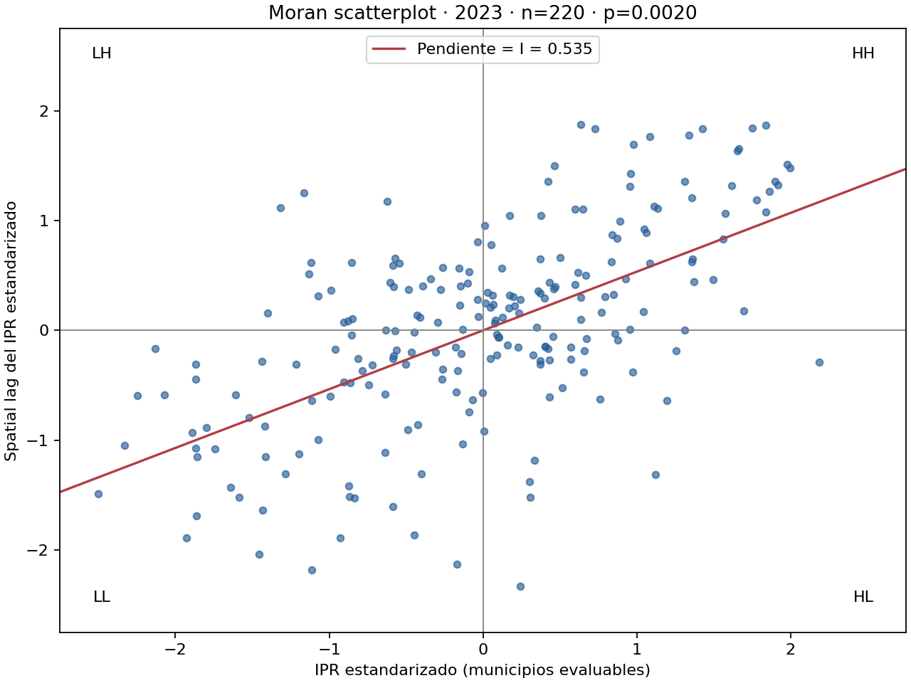
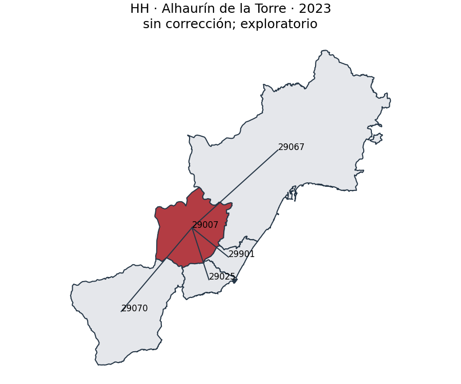
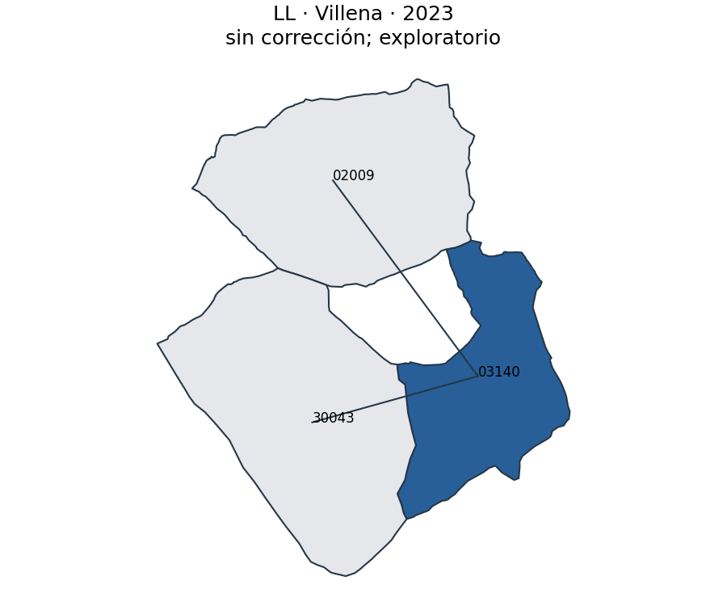
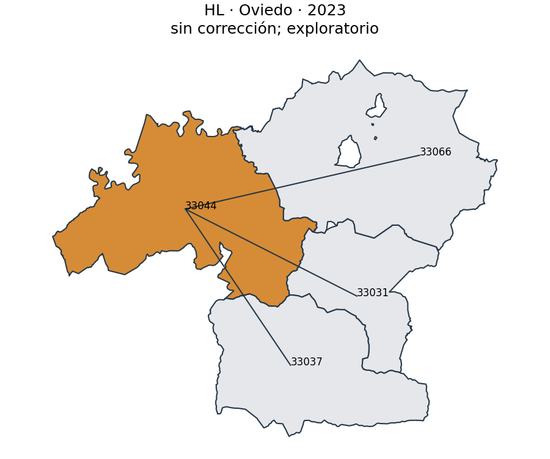
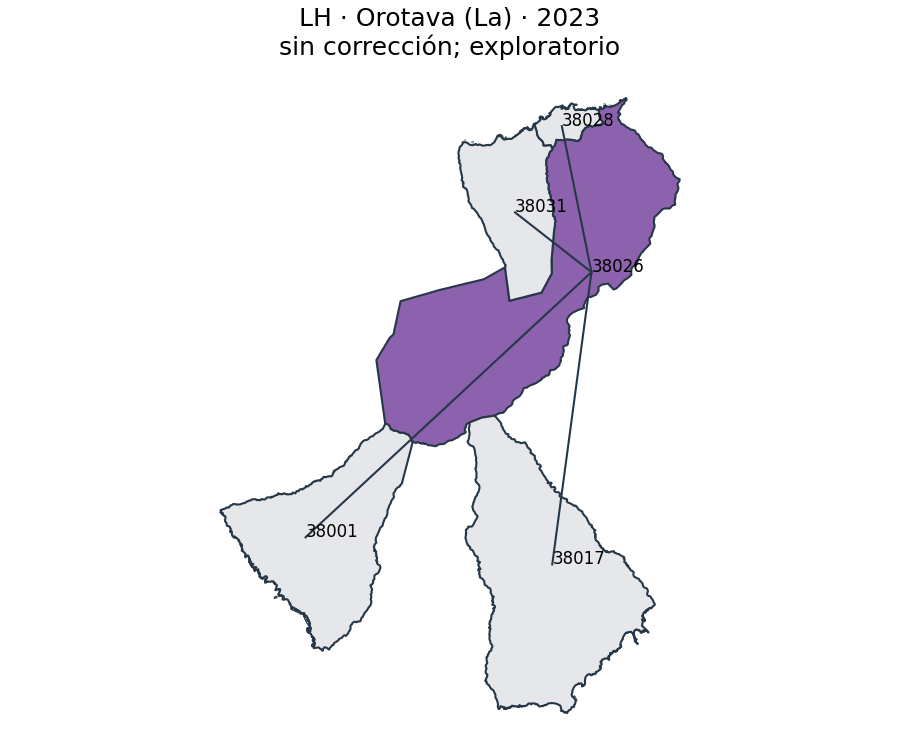
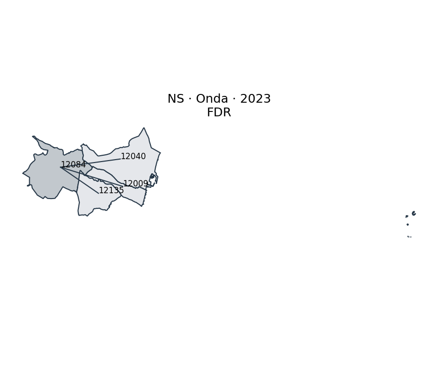

# Auditoría y resultados espaciales del IPR

Versión: spatial-ipr-1.0.0. Semilla: 2023.

## Auditoría previa

| Comprobación | Resultado |
|---|---:|
| municipios_ipr | 306 |
| municipios_con_geometria | 306 |
| geometrias_validas | 306 |
| geometrias_nulas | 0 |
| geometrias_vacias | 0 |
| municipios_sin_match | 0 |
| municipios_sin_vecinos | 86 |
| crs | EPSG:4326 |
| geometrias_invalidas | 0 |
| geometrias_duplicadas | 0 |
| ids_geometria_duplicados | 0 |
| ids_ipr_duplicados | 0 |

## Vecindad y alcance

Queen es la matriz principal, normalizada por fila. Rook se compara antes de mirar significación.
El universo es una muestra municipal discontinua: ausencia de vecinos en la muestra no implica aislamiento físico.

| Método | Enlaces dirigidos | Aislados | Componentes | Vecinos mín./máx./media |
|---|---:|---:|---:|---|
| queen | 540 | 86 | 128 | 0/13/1.76 |
| rook | 532 | 88 | 130 | 0/13/1.74 |

KNN k=1 evaluado en 86 aislados: distancia elipsoidal al punto representativo del candidato más cercano, mín. 7.2 km, mediana 30.4 km, máx. 162.8 km. No aplicado: proximidad entre puntos no acredita contigüidad ni conectividad territorial, especialmente a través del mar. Se conserva Queen y se explicita su cobertura.

| Municipio aislado | INE | Candidato KNN (no aplicado) | km |
|---|---|---|---:|
| Vitoria | 01059 | 09219 | 31.8 |
| Villarrobledo | 02081 | 13082 | 35.9 |
| Alcoy/Alcoi | 03009 | 46184 | 17.4 |
| Benidorm | 03031 | 03139 | 11.3 |
| Calpe/Calp | 03047 | 03082 | 16.3 |
| Ávila | 05019 | 40194 | 52.0 |
| Ciutadella de Menorca | 07015 | 07032 | 30.4 |
| Inca | 07027 | 07036 | 20.3 |
| Mahón | 07032 | 07015 | 30.4 |
| Manacor | 07033 | 07027 | 32.5 |
| Granollers | 08096 | 08124 | 7.2 |
| Igualada | 08102 | 08113 | 23.4 |
| Manresa | 08113 | 08279 | 21.7 |
| Mataró | 08121 | 08172 | 10.2 |
| Pineda de Mar | 08163 | 17023 | 11.6 |
| Premià de Mar | 08172 | 08121 | 10.2 |
| Vic | 08298 | 17114 | 35.4 |
| Vilafranca del Penedès | 08305 | 08231 | 11.6 |
| Aranda de Duero | 09018 | 42173 | 64.6 |
| Burgos | 09059 | 09219 | 69.0 |
| Miranda de Ebro | 09219 | 01059 | 31.8 |
| Plasencia | 10148 | 10037 | 68.7 |
| Algeciras | 11004 | 11022 | 16.4 |
| Alcázar de San Juan | 13005 | 13082 | 23.8 |
| Ciudad Real | 13034 | 13071 | 36.3 |
| Puertollano | 13071 | 13034 | 36.3 |
| Tomelloso | 13082 | 13005 | 23.8 |
| Valdepeñas | 13087 | 13034 | 52.3 |
| Córdoba | 14021 | 41039 | 47.7 |
| Lucena | 14038 | 14056 | 21.3 |
| Puente Génil | 14056 | 14038 | 21.3 |
| Carballo | 15019 | 15005 | 16.5 |
| Ribeira | 15073 | 36060 | 21.9 |
| Cuenca | 16078 | 44216 | 68.7 |
| Figueres | 17066 | 17079 | 32.7 |
| Olot | 17114 | 17155 | 32.8 |
| Almuñecar | 18017 | 18140 | 21.0 |
| Granada | 18087 | 18017 | 47.1 |
| Motril | 18140 | 18017 | 21.0 |
| Guadalajara | 19130 | 19046 | 17.0 |
| Eibar | 20030 | 48027 | 17.3 |
| Irun | 20045 | 20067 | 9.2 |
| Huelva | 21041 | 21044 | 24.5 |
| Lepe | 21044 | 21041 | 24.5 |
| Huesca | 22125 | 50297 | 63.2 |
| Andújar | 23005 | 23055 | 36.9 |
| Jaén | 23050 | 23055 | 36.0 |
| Linares | 23055 | 23092 | 27.3 |
| Úbeda | 23092 | 23055 | 27.3 |
| Ponferrada | 24115 | 24142 | 73.8 |
| Lleida | 25120 | 43123 | 67.8 |
| Logroño | 26089 | 01059 | 44.5 |
| Lugo | 27028 | 15058 | 72.3 |
| Antequera | 29015 | 14038 | 33.0 |
| Ronda | 29084 | 29051 | 37.9 |
| Pamplona/Iruña | 31201 | 20067 | 53.1 |
| Tudela | 31232 | 50297 | 74.2 |
| Ourense | 32054 | 36038 | 62.2 |
| Avilés | 33004 | 33024 | 19.4 |
| Palencia | 34120 | 47186 | 44.3 |
| Arrecife | 35004 | 35014 | 50.7 |
| Cangas | 36008 | 36057 | 10.2 |
| Vilagarcía de Arousa | 36060 | 36038 | 21.8 |
| Salamanca | 37274 | 49275 | 62.7 |
| Candelaria | 38011 | 38026 | 14.7 |
| Castro-Urdiales | 39020 | 48082 | 14.4 |
| Torrelavega | 39087 | 39016 | 14.7 |
| Segovia | 40194 | 28047 | 32.4 |
| Écija | 41039 | 14056 | 30.4 |
| Mairena del Aljarafe | 41059 | 41021 | 7.4 |
| Morón de la Frontera | 41065 | 41004 | 37.6 |
| Soria | 42173 | 09018 | 64.6 |
| Tortosa | 43155 | 12138 | 35.5 |
| Vendrell (El) | 43163 | 08307 | 16.0 |
| Teruel | 44216 | 16078 | 68.7 |
| Illescas | 45081 | 28106 | 13.0 |
| Talavera de la Reina | 45165 | 45168 | 77.4 |
| Gandia | 46131 | 46181 | 14.6 |
| Xàtiva | 46145 | 46017 | 18.1 |
| Ontinyent | 46184 | 03009 | 17.4 |
| Valladolid | 47186 | 34120 | 44.3 |
| Durango | 48027 | 48036 | 15.4 |
| Zamora | 49275 | 37274 | 62.7 |
| Zaragoza | 50297 | 22125 | 63.2 |
| Ceuta | 51001 | 11004 | 27.2 |
| Melilla | 52001 | 04902 | 162.8 |

## Moran global y multiplicidad

Contraste bilateral de permutaciones (dos veces la cola inclusiva menor, con corrección +1).
FDR Benjamini–Hochberg es la vista principal: reduce descubrimientos locales espurios; se conserva una vista exploratoria sin corrección.
Los NS incluyen aislados no evaluables, identificados por separado. El denominador de porcentajes es todo el universo.

| Año | n evaluados/total | I | E[I] | z perm. | p bilateral | Sin corrección | FDR |
|---|---:|---:|---:|---:|---:|---:|---:|
| 2023 | 220/306 | 0.535490 | -0.004566 | 7.706 | 0.0020 | 27 | 0 |

## Categorías y revisión municipal · 2023

Permutaciones: 999. Alfa: 0.05. Agrupación espacial significativa.

| Categoría | FDR | % universo | Sin corrección |
|---|---:|---:|---:|
| HH | 0 | 0.00% | 13 |
| LL | 0 | 0.00% | 10 |
| HL | 0 | 0.00% | 3 |
| LH | 0 | 0.00% | 1 |
| NS | 306 | 100.00% | 279 |

Los cuadrantes son descriptivos; pertenecer a HH en el scatterplot no acredita un clúster significativo.

Muestra determinista por categoría: menor p entre los evaluables. Si no hay ejemplos FDR, se revisa el resultado exploratorio y se indica expresamente.

### HH: Alhaurín de la Torre (29007) — sin corrección; exploratorio

IPR 64.65; z 0.634; lag(z) 1.876; I local 1.1839; p 0.0020; q FDR 0.0880.

| Vecino INE | Nombre | IPR | z | Peso |
|---|---|---:|---:|---:|
| 29025 | Benalmádena | 88.88 | 1.917 | 0.250 |
| 29067 | Málaga | 90.36 | 1.995 | 0.250 |
| 29070 | Mijas | 83.24 | 1.618 | 0.250 |
| 29901 | Torremolinos | 90.01 | 1.976 | 0.250 |

### LL: Villena (03140) — sin corrección; exploratorio

IPR 31.65; z -1.113; lag(z) -2.182; I local 2.4181; p 0.0020; q FDR 0.0880.

| Vecino INE | Nombre | IPR | z | Peso |
|---|---|---:|---:|---:|
| 02009 | Almansa | 5.40 | -2.503 | 0.500 |
| 30043 | Yecla | 17.49 | -1.862 | 0.500 |

### HL: Oviedo (33044) — sin corrección; exploratorio

IPR 58.38; z 0.302; lag(z) -1.379; I local -0.4145; p 0.0200; q FDR 0.2316.

| Vecino INE | Nombre | IPR | z | Peso |
|---|---|---:|---:|---:|
| 33031 | Langreo | 13.52 | -2.073 | 0.333 |
| 33037 | Mieres | 18.73 | -1.797 | 0.333 |
| 33066 | Siero | 47.64 | -0.267 | 0.333 |

### LH: Orotava (La) (38026) — sin corrección; exploratorio

IPR 40.87; z -0.625; lag(z) 1.175; I local -0.7308; p 0.0100; q FDR 0.1571.

| Vecino INE | Nombre | IPR | z | Peso |
|---|---|---:|---:|---:|
| 38001 | Adeje | 84.74 | 1.698 | 0.250 |
| 38017 | Granadilla de Abona | 67.04 | 0.760 | 0.250 |
| 38028 | Puerto de la Cruz | 93.98 | 2.187 | 0.250 |
| 38031 | Realejos (Los) | 53.68 | 0.053 | 0.250 |

### NS: Onda (12084) — FDR

IPR 25.94; z -1.415; lag(z) -1.153; I local 1.6241; p 0.0520; q FDR 0.4086.

| Vecino INE | Nombre | IPR | z | Peso |
|---|---|---:|---:|---:|
| 12009 | Almazora/Almassora | 30.05 | -1.198 | 0.333 |
| 12040 | Castellón de la Plana | 45.08 | -0.402 | 0.333 |
| 12135 | Villarreal/Vila-real | 17.56 | -1.859 | 0.333 |

## Alcance de las conclusiones

RQ2: Moran global contrasta estructura espacial en los municipios con contigüidad dentro de la muestra; LISA localiza asociaciones y outliers.
La existencia de autocorrelación espacial indica que la distribución territorial del IPR no es independiente del entorno geográfico, pero no demuestra relaciones causales entre municipios.
El IPR mide intensidad relativa; Moran mide estructura espacial. No son intercambiables.
DQS no está implementado en esta revisión del proyecto; se conserva como no disponible, sin sustituirlo por cobertura.
Solo se publica histórico si el fichero de entrada contiene años, universo y metodología comparables. Actualmente solo existe el corte 2023.
